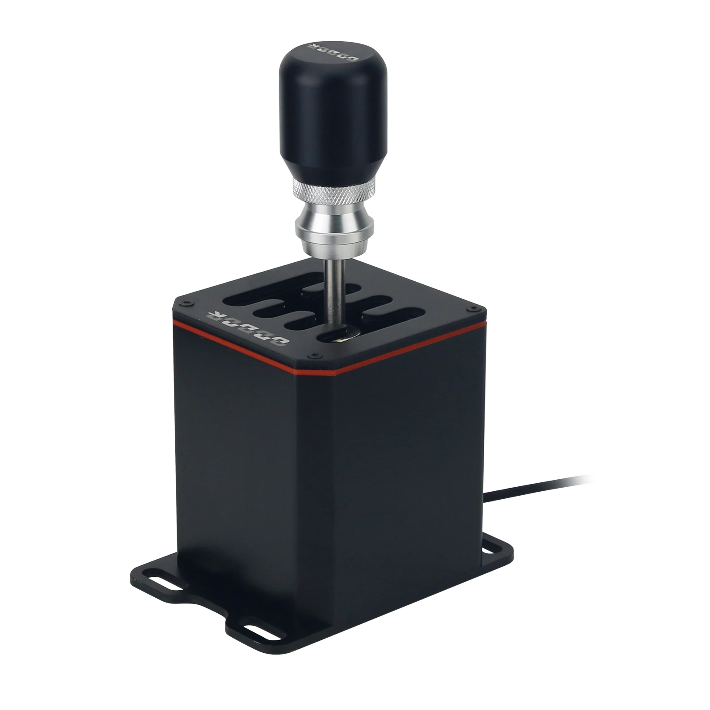

# ODDOR Shifter 7+R driver
User space driver for ODDOR Shifter 7+R



## Manual installation
### Build
```
git clone https://github.com/Buhanki/oddor_shifter_hid_driver.git
cd oddor_shifter_hid_driver
cmake .
make
```
### Install
```
# cp oddor_shifter_hid_driver /usr/bin/
```
We also need to add udev and hwdb rules.
```
# cp 99-oddor-shifter.rules /etc/udev/rules.d/
```
Reload udev.
```
# udevadm control --reload && udevadm trigger
```
As well as the systemd service.
```
# cp oddor-driver.service /usr/lib/systemd/system/
```
Reload systemd units.
```
# systemctl daemon-reload
```
And start it.
```
# systemctl enable --now oddor-driver.service
```
Add user in input gproup
```
# usermod -aG uinput $USER
```
This is my first driver, it will improve over time.
